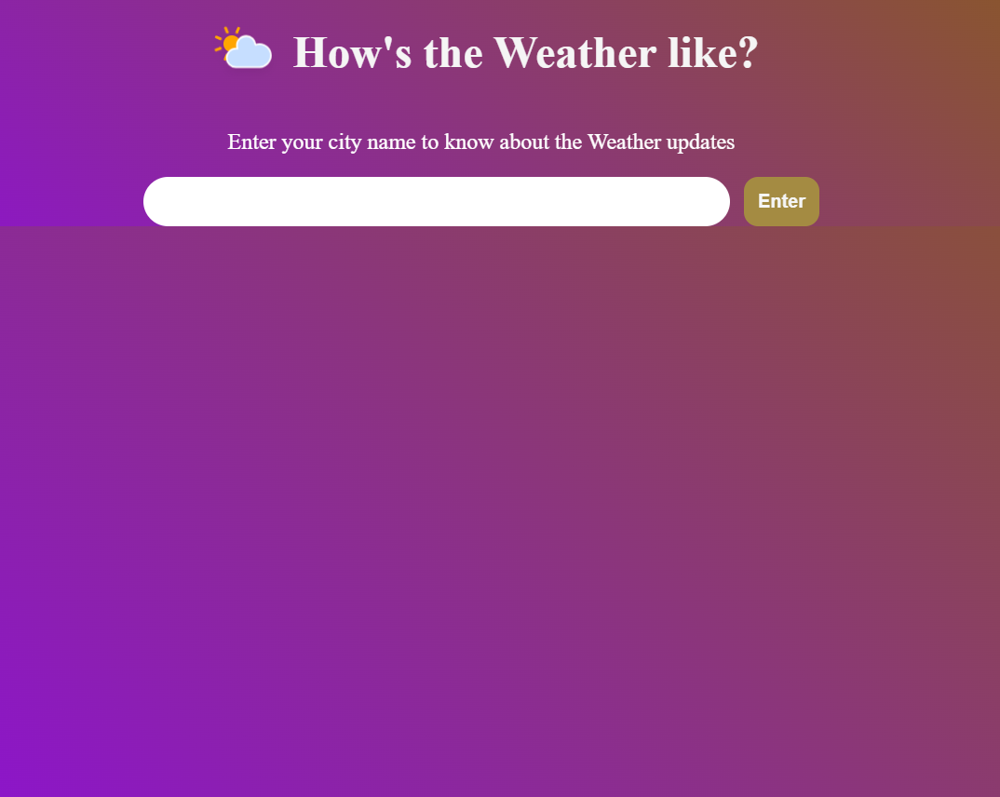
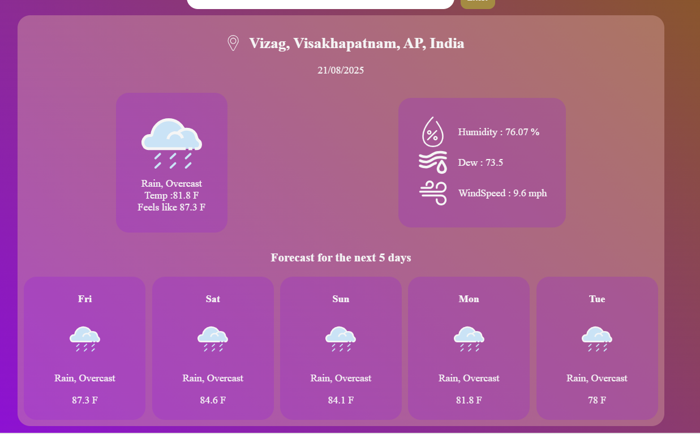

Weather-App

Weather-App is a webapplication usimg visualcrossing API.
It shows weahther updates like day conditions, temperature, humidity, dew and windspeed.
It also gives updates for the next 5 days.
This data can be extended to increase forecast days.

Following is how the initial screen looks

User can enter any city and they get updates aout the city

if the user enters an invalid city, it shows error

